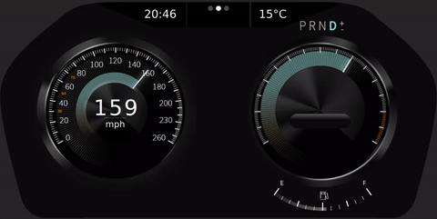

### Preview
<p align="center">

</p>

---

### This project is created by

	- kyunghwan.abel.bae@gmail.com
	- tredici0@gmail.com
	- igeneralstore@gmail.com
	
---

### qtivi original tutorial : 
https://doc.qt.io/QtIVI/qtivi-ivicore-qface-tutorial-example.html

---

### Usages

qmake & make in 
>>frontend/frontend.pro<br>
>>backend_simulator/backend_simulator.pro<br> 
>>imports/imports.pro<br> 
>>backend_qtra/backend_qtra.pro<br>
>>simulation_server/simulation_server.pro<br>
are required for building this project.

The proper result(synced output) can be confirmed by running an 'ipc-server' and starting this project more than two times.

---

### Error handlings

#### (1)
If you get the error message at
```c
#include <QIviStandardItem>
```
then changed to 
```c
#include <QtIviCore/QIviStandardItem>
```
